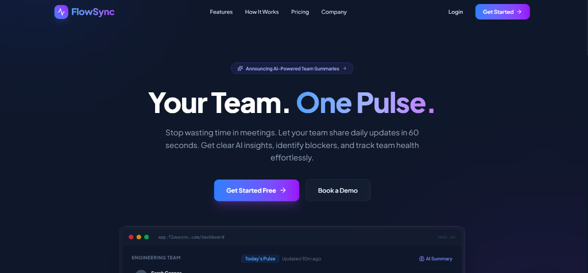

# ⚡ FlowSync — Team Pulse Manager

FlowSync is a premium, real-time status tracker and team synchronization application. It automates sentiment mapping, blocker identification, and daily update summaries using state-of-the-art AI. Designed with an ultra-modern dark navy glassmorphic layout, it features interactive dashboards for both team members and managers.



---

## 💡 Why FlowSync?

Traditional status updates and daily standup meetings are often tedious, disruptive, and time-consuming. Team members spend valuable time writing or explaining updates, while managers struggle to manually track individual morale trends, verify blocker resolution, and compile team progress reports.

**FlowSync solves this by creating a structured, AI-driven feedback loop:**
*   **60-Second Submissions**: Team members submit their updates in seconds, either by typing or utilizing the native browser Web Speech API for hands-free voice dictation.
*   **Zero Manual Summarization**: Groq Llama 3 AI instantly parses updates to determine mood sentiment, summarize accomplishments, and flag blockers.
*   **Actionable Management Tools**: Managers get a centralized "pulse" dashboard to view real-time team statistics, search/filter members, log private coaching notes, resolve blockers, and view weekly consistency leaderboards.

---

## 🚀 Key Features

### 👥 Team Member Portal
*   **Structured Daily Updates**: Simple status logging input field with quick-select prompt chips (`Done:`, `Next:`, `Blockers:`).
*   **Speech-to-Text Dictation**: Speak to log updates hands-free using real-time browser Web Speech API transcription.
*   **Instant AI Feedback**: Every submission is processed by Llama 3 to return a sentiment badge, a bulleted summary, blocker warnings, and a custom motivational quote.
*   **Update History Timeline**: Expandable history card feed displaying calendar markers, sentiment tags, and archived AI summaries.
*   **My Trend Widget**: Active 3-day sentiment trend graph displaying visual morale progress over the current week.
*   **Team Leaderboard**: Ranks the top team members by weekly updates count, highlighting the current user in purple.
*   **Profile Settings & Preferences**: Configure profile name and set a daily email/notification reminder time (e.g. `09:00`).

### 📊 Manager Dashboard Portal
*   **4-Point Pulse Metrics Row**: Real-time counters showing Total Members, Updates Submitted Today, Pending Updates (with click action to notify), and Team Health Morale.
*   **AI Daily Team Summary**: Generates team overview summaries, highlight accomplishments, blocker rollups, and manager coaching recommendations at the click of a button.
*   **Team Pulse Feed**: Chronological list of team updates with expandable log previews, relative time stamps, and sentiment pills.
*   **Search & Filters**: Search members dynamically by name, or filter lists by status (`All Members`, `Submitted Today`, `Pending Today`, `Has Blockers`).
*   **Private Manager Notes**: Keep secure, private notes on individual members (e.g., performance progress, coaching remarks) that are kept completely hidden from member-facing API scopes.
*   **Sticky Note Indicators**: A pulsing yellow sticky note icon appears next to members with saved notes.
*   **Sparkline Activity & 7-Day History**: Mini Recharts sparklines showing submission frequency alongside 7 colored sentiment dots.
*   **Direct Messaging Channel**: Send direct feedback messages and notes straight to a member's dashboard.
*   **Blocker Bell Notifications**: Navigation bar bell icon 🔔 displaying a red notification dot if any team member flags a blocker, expanding to show warning summaries on click.

---

## 🛠️ Tech Stack

### Frontend
*   **React (v19)** & **Vite**: Rapid, lightweight production bundles.
*   **TailwindCSS (v4)**: Modern utility-first CSS styling framework.
*   **Framer Motion**: Fluid, spring-based animations and page route transitions.
*   **Recharts**: Interactive data visualizations and line/bar charts.
*   **Lucide Icons**: Crisp, responsive SVG icon set.

### Backend
*   **Node.js** & **Express.js**: REST API server.
*   **MongoDB** & **Mongoose**: Schemas, relational models, and document storage.
*   **Groq SDK**: Connects Llama 3.1 (`llama-3.1-8b-instant`) for structural JSON parsing and analysis.

---

## 🗄️ Database Schemas

### 1. User Model (`User.js`)
```javascript
{
  name: { type: String, required: true },
  email: { type: String, required: true, unique: true },
  password: { type: String, required: true },
  role: { type: String, enum: ['manager', 'member'], default: 'member' },
  teamId: { type: Schema.Types.ObjectId, ref: 'Team', default: null },
  reminderTime: { type: String, default: '09:00' },
  managerNote: { type: String, default: '' },
  createdAt: { type: Date, default: Date.now }
}
```

### 2. Team Model (`Team.js`)
```javascript
{
  name: { type: String, required: true },
  managerId: { type: Schema.Types.ObjectId, ref: 'User', required: true },
  inviteCode: { type: String, required: true, unique: true }, // e.g. FL4829
  members: [{ type: Schema.Types.ObjectId, ref: 'User' }],
  createdAt: { type: Date, default: Date.now }
}
```

### 3. Update Model (`Update.js`)
```javascript
{
  userId: { type: Schema.Types.ObjectId, ref: 'User', required: true },
  teamId: { type: Schema.Types.ObjectId, ref: 'Team', required: true },
  updateText: { type: String, required: true },
  sentiment: { type: String, enum: ['positive', 'negative', 'neutral'], required: true },
  summary: { type: String, required: true },
  hasBlocker: { type: Boolean, default: false },
  blockerText: { type: String, default: '' },
  date: { type: Date, required: true },
  createdAt: { type: Date, default: Date.now },
  lastEditedAt: { type: Date }
}
```

---

## ⚙️ Environment Variables

### Backend (`/server/.env`)
Create a `.env` file inside the `server/` directory:
```env
PORT=5000
MONGO_URI=mongodb+srv://<username>:<password>@<cluster>.mongodb.net/<database_name>
JWT_SECRET=your_jwt_secret_key_here
GROQ_API_KEY=your_groq_api_key_here
```

---

## 🏃 How to Run Locally

### Prerequisites
*   Node.js (v18+)
*   MongoDB installed and running locally on port `27017` (or MongoDB Atlas URI)

### Step 1: Clone the Project
```bash
git clone https://github.com/piyush5093/FlowSync.git
cd FlowSync
```

### Step 2: Configure & Start Backend Server
1. Navigate to the server folder:
   ```bash
   cd server
   ```
2. Install dependencies:
   ```bash
   npm install
   ```
3. Initialize the `.env` variables (as described above).
4. Run in development mode:
   ```bash
   npm run dev
   ```
   *The server will start running on [http://localhost:5000](http://localhost:5000).*

### Step 3: Configure & Start Frontend Client
1. Open a new terminal in the root folder and navigate to client:
   ```bash
   cd client
   ```
2. Install dependencies:
   ```bash
   npm install
   ```
3. Start the dev compiler:
   ```bash
   npm run dev
   ```
   *The client will start running on [http://localhost:5173](http://localhost:5173).*

---

## 🌐 Production Deployment Instructions

### MongoDB Atlas Setup
1. Log in to **MongoDB Atlas** and create a cluster.
2. Under **Network Access**, select **Add IP Address** and whitelist `0.0.0.0/0` (allows Render to query the database dynamically).
3. Under **Database Access**, create a user and copy the connection string.

### Backend Deployment (Render)
1. Log in to **Render** and create a new **Web Service**.
2. Link your FlowSync repository.
3. Configure the following build settings:
   *   **Root Directory**: `server`
   *   **Build Command**: `npm install`
   *   **Start Command**: `npm start`
4. Under **Environment Variables**, add:
   *   `MONGO_URI` (your MongoDB Atlas connection string)
   *   `JWT_SECRET` (a strong custom secret string)
   *   `GROQ_API_KEY` (your Llama 3 Groq key)
   *   `PORT` (set to `5000` or leave default)

### Frontend Deployment (Vercel)
1. Log in to **Vercel** and select **Add New Project**.
2. Link your FlowSync repository.
3. Configure the following build settings:
   *   **Root Directory**: `client`
   *   **Build Command**: `npm run build`
   *   **Output Directory**: `dist`
4. Under **Environment Variables**, configure the base API link to point to your Render backend:
   *   `VITE_API_BASE_URL`: `https://your-backend-name.onrender.com`

---

## 👨‍💻 Author
Built with ❤️ by **Piyush Sharad Patil**
